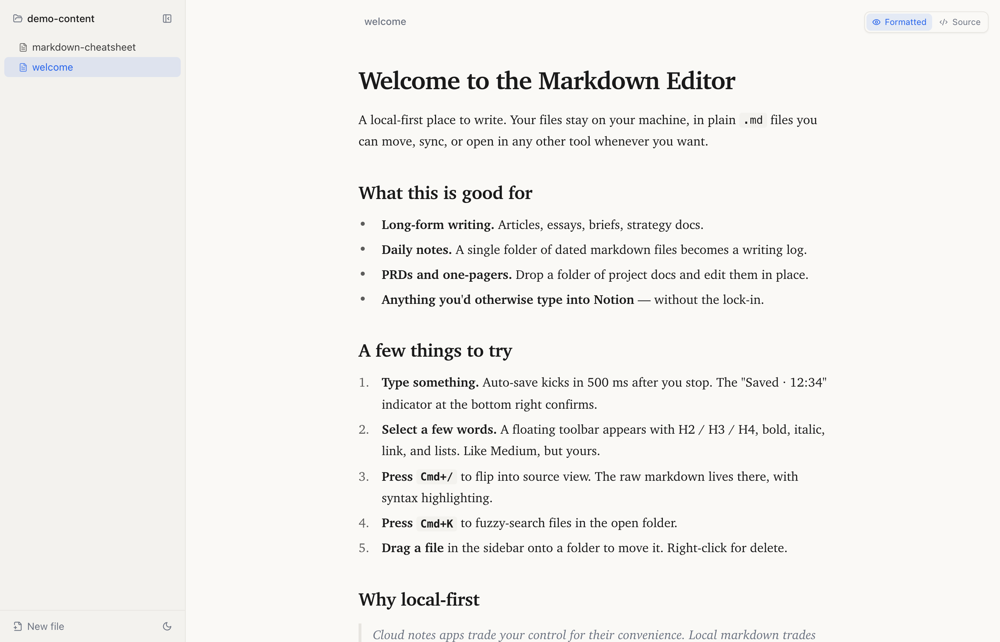
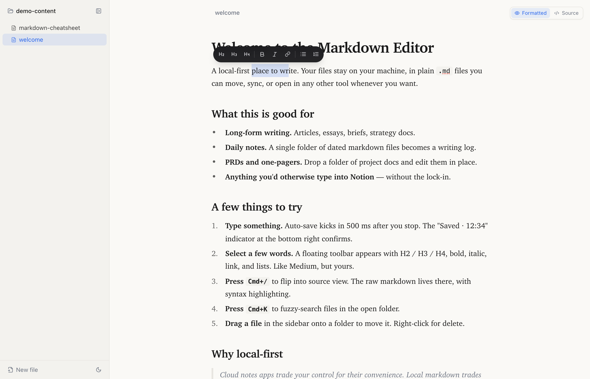
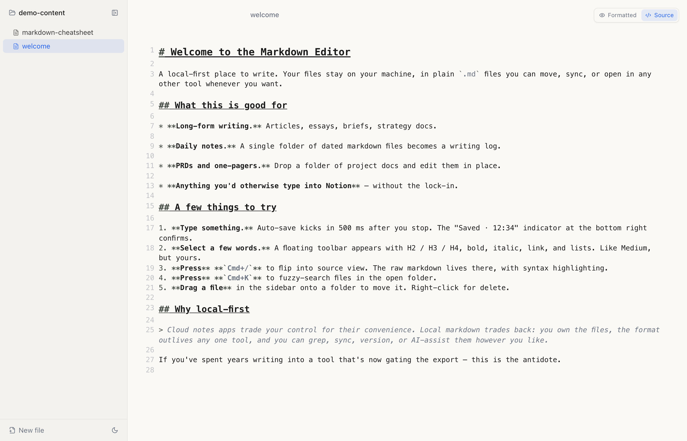
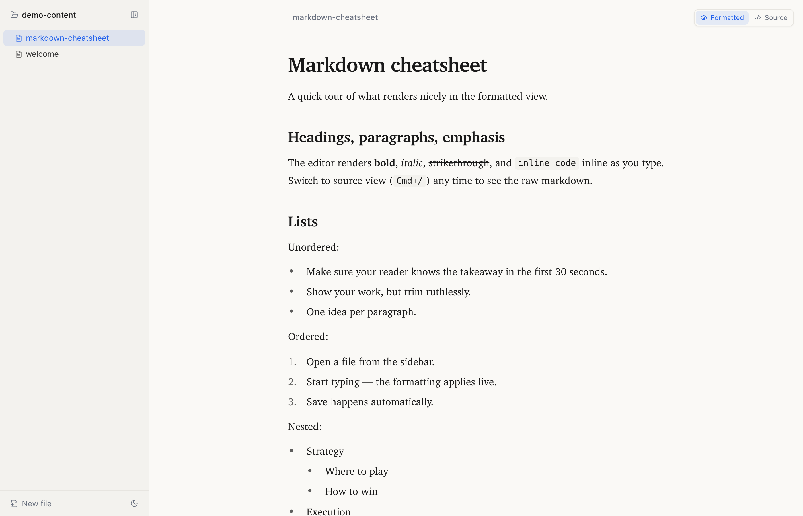

# Markdown Editor

A local-first markdown editor with live formatting and auto-save. Built for the kind of long-form writing you don't want stuck in a notes app or behind a cloud sync.

Built by [Hustle Badger](https://hustlebadger.com) — practical training in product management and AI skills.



## What it does

- **Live-formatted editing** (Typora-style) — formatting renders inline as you type, but everything stays editable.
- **Source view toggle** (`Cmd+/`) — flip to raw markdown with syntax highlighting any time.
- **Auto-save to disk** — every change writes to a real `.md` file ~500 ms after you stop typing. No cloud, no lock-in, your files stay yours.
- **External-edit aware** — if you edit a file in another tool (Cursor, vim, Obsidian) it reloads in the editor automatically, without losing your in-progress changes.
- **Floating selection toolbar** — Medium-style. Select text to get H2 / H3 / H4, bold, italic, link, bullet list, numbered list. Click an active heading to convert it back to a paragraph.

  

- **Source view with syntax highlighting** — `Cmd+/` to flip.

  

- **Command palette** (`Cmd+K`) — fuzzy file search across the open folder.
- **Drag and drop** to move files between folders. Right-click any file for a delete menu.
- **Inline rename** — click the filename above the editor to rename the file in place.
- **Resizable sidebar** — drag the right edge between 180 px and 800 px; width persists.
- **Light + dark mode** — follows system, manual toggle in the sidebar footer.

  

## Quick start

You'll need [Node.js 20+](https://nodejs.org).

```bash
git clone https://github.com/edbadger/markdown-editor.git
cd markdown-editor
npm install
npm run dev
```

Open <http://localhost:5173>. The first run prompts you for an absolute path to a folder of `.md` files — try the included `demo-content/` folder for a quick tour. Recent folders are remembered.

## Pin in your browser

Once `npm run dev` is running, you have two ways to keep it one click away:

- **Pinned tab.** Open the URL, right-click the tab → Pin. Survives browser restarts.
- **Install as a desktop app.** In Chrome or Edge, open the URL, click the install icon in the address bar (or ⋮ → "Install Markdown Editor…"). Gives you a dedicated window with no browser chrome and an icon in your dock / Launchpad / Start menu.

## Auto-start at login (macOS)

If you want the dev server to come up on every login so the pinned tab / installed app always works, install the included LaunchAgent:

```bash
bash scripts/install-launch-agent.sh
```

The script substitutes your install path into the plist template and registers it with `launchctl`. To remove:

```bash
bash scripts/install-launch-agent.sh --uninstall
```

Logs go to `~/Library/Logs/markdown-editor.log`.

## Keyboard shortcuts

| Shortcut | Action |
|---|---|
| `Cmd+/` | Toggle formatted ↔ source view |
| `Cmd+K` | Open command palette / file search |
| `Cmd+Z` | Undo |
| `Cmd+Shift+Z` | Redo |
| `Cmd+B` / `Cmd+I` | Bold / italic in formatted view |
| `Esc` | Close palette / cancel rename |

## Architecture

```
src/        # React frontend (Vite + TypeScript + Tailwind)
  components/  # Sidebar, EditorPane, FormattedEditor, SourceEditor, SelectionToolbar, …
  hooks/       # useFolderState, useFileContent, useAutoSave, useFileWatcher, useTheme
  lib/         # Fetch wrappers, types
server/     # Express backend (port 47821, localhost-only)
  routes/      # /api/root, /api/folders, /api/files, /api/watch
public/     # PWA manifest + icons
scripts/    # LaunchAgent installer
demo-content/   # Sample markdown to try the editor on
```

The Vite dev server (5173) proxies `/api/*` to Express (47821). Both are bound to localhost only — nothing is exposed to the network.

### Auto-save and the watcher

Saves are debounced 500 ms, then PUT to `/api/files`. On tab hide / window close, any pending save is flushed via `navigator.sendBeacon`. The server marks each write with a `mtime` and the client tracks the last-known mtime per file; when chokidar fires a `change` event, the client only reloads if the event's mtime is **newer** than what it last wrote — distinguishing "echo of my own save" from a genuine external edit.

### Path safety

The server keeps a single active root folder. Every file path is resolved against that root and rejected if it escapes via `..` or absolute paths. Only `.md`, `.markdown`, and `.mdx` files are readable / writable.

## Tech

- [Milkdown](https://milkdown.dev) (ProseMirror) — live-formatted editor surface
- [CodeMirror 6](https://codemirror.net) — source view with markdown syntax highlighting
- [Tailwind CSS](https://tailwindcss.com) — styling
- [chokidar](https://github.com/paulmillr/chokidar) — file watcher
- Server-Sent Events — push file changes to the client

## License

MIT — see [LICENSE](LICENSE).

---

For more free tools and templates, check out **[hustlebadger.com](https://hustlebadger.com)** — practical training in product management and AI skills for the people actually shipping the work.
